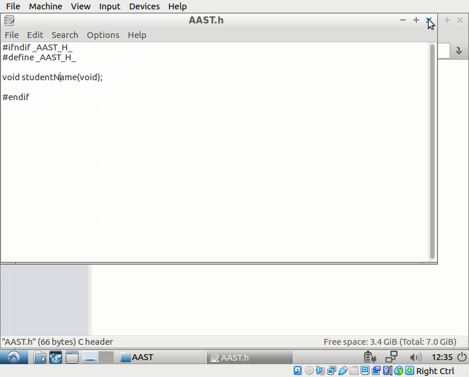

# OSLab Project 

### 1- Install virtual machine
### 2- Build default kernel
### 3- Add "studentName()"
### 4- Add calculator to menu

<hr/>
<hr/>
<hr/>

## 1- Install virtual machine

- using lubuntu 16 iso, 1-GB RAM, 8-GB memory 


- install git
```
$ sudo apt-get install git
```


- install toolchain
```
$ sudo add-apt-repository ppa:ops-class/os161-toolchain
$ sudo apt-get update
$ sudo apt-get install os161-toolchain
```


- Creaete OSLab folder and clone repository
```
$ git clone https://github.com/Dodger23/os161 src
```


</br>
<hr/>
<hr/>
<hr/>
</br>
</br>

## 2- Build defualt kernel

- Run configure file


- Go to kern/conf and configure DUMBVM
```
cd kern/conf
./config DUMBVM
```


- Go to DUMBVM and bmake
```
cd ../compile/DUMBVM
bmake depend
bmake
bmake install
```
!! NOTICE : BECAUSE THIS IS THE FIRST BUILD WE DON'T NEED TO RUN " bmake clean" !!


- To run the compiled kernel we go to root directory and run sys161 kernel</br>
!! NOTICE : DOWNLOAD "sys161.conf" IF THIS IS THE FIRST TIME !!
```
cd ~/root
sys161 kernel
```


</br>
<hr/>
<hr/>
<hr/>
</br>
</br>


## 3- Add "studentName()" 

- Go to os161/kern and make a new folder named "AAST" which will include our "studentName.c" file
- make new header file "AAST.h" and add our function in it



- make new C file "studentName.c"
- write function in "studentName.c" to print student name and ID 
- include header file "AAST.h"
- include header file "lib.h" to use "kprintf()" 
- include header file "types.h" to be able to use this file in main


- Go to kern/conf.kern file to add our C file "studentName.c" path 


- Go to main/main.c and add header file "AAST.h"
``` 
#include <AAST.h>
```


- Notify th program that studentName() is an external function 
```
extern void studentName();
```


- Call the studentName() function inside the boot function 


- Recompile and build the kernel with same Build steps 
!! NOTICE : ADD "bmake clean" TO CLEAN PREVIOUS COMPILE FILES


- Go to ~/root and run sys161.conf to run 
```
cd ~/root
sys161 kernel
```

 


</br>
<hr/>
<hr/>
<hr/>
</br>
</br>


## 4- Add calculator to menu

- Add calculator function in studentName.c file 
- include the function definition in the header file "AAST.h"


- include header file "AAST.h" in the menue.c to be able to use the calculator function 


- Create new function "cmd_calculator" calls the our calculator function


- Add "[C] Calculator" to the menu options 


- Trigger the cmd_calculator() when choosing "C" from the menu


- Recompile and build the kernel with same Build steps</br>
!! NOTICE : ADD "bmake clean" TO CLEAN PREVIOUS COMPILE FILES

- Go to ~/root and run sys161.conf to run 
```
cd ~/root
sys161 kernel
```


 
